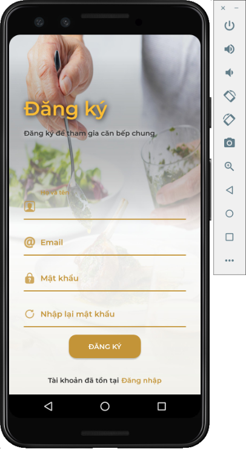
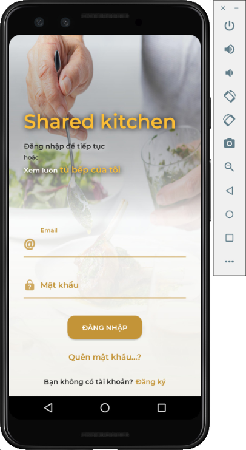
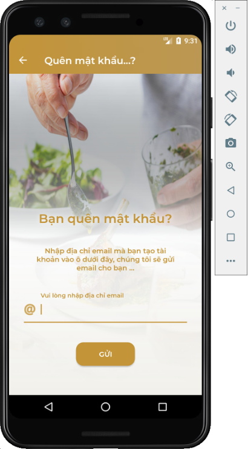
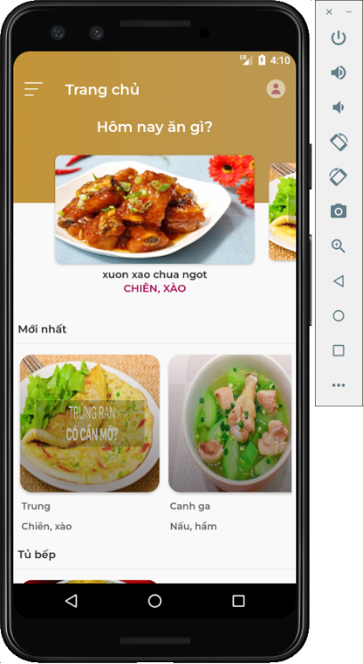
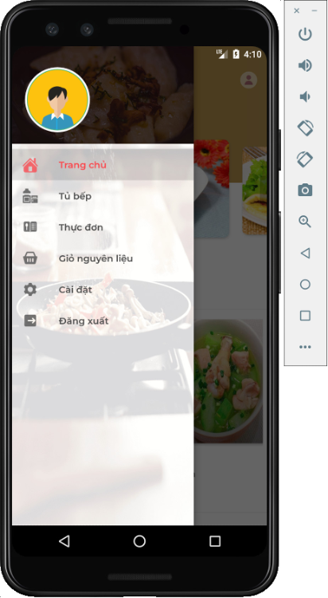
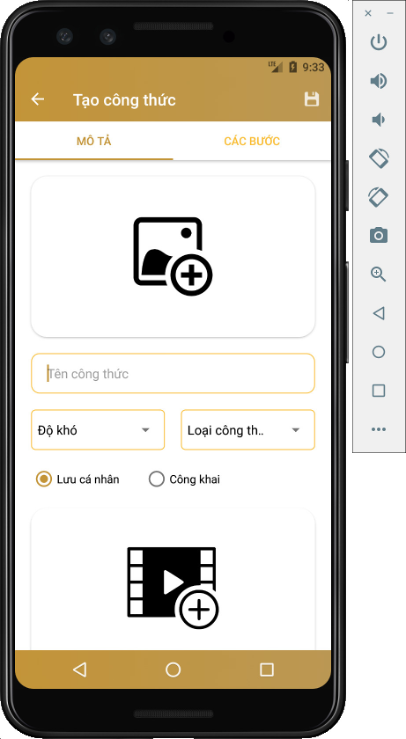
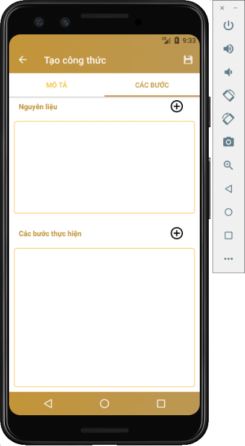
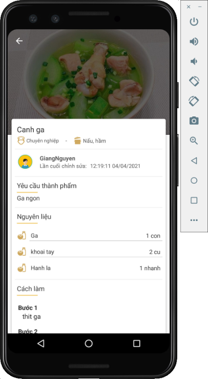

 # Shared-kitchen

Recipe sharing app

## Features 
* Account management
* Share recipes
* See everyone's recipes
* Make a list of ingredients to buy
* Create menus with recipes

## Screen Shot
|  |  |  | |
| - | - | - | - |
|  |  |  | |

## Development team
* [Phuc Tran Ba](https://github.com/phuctranba)

## Development purpose
Personal projects
